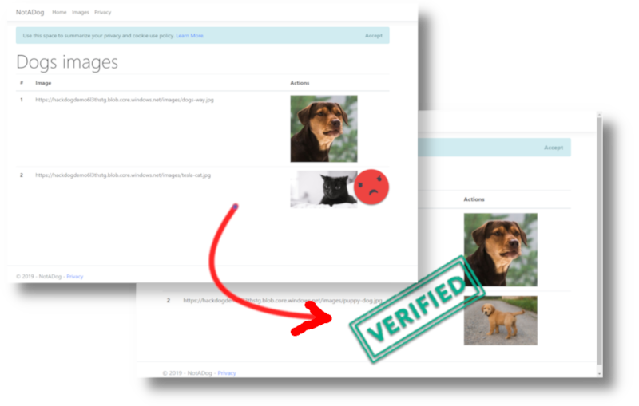

# Not a Dog Workshop

This workshop is for beginners who would like to learn more about the cloud and the try some services available. Today artificial intelligence (AI) can benefit a lot of our application and most of the time it's easier than we think to implement it.

During this workshop you will deploy and complete a web application able to detect when the pictures are or not dogs and keep our image folder "clean". We call that application: *The automatic Not a Dog application*.

> We are using dogs as topics, but you can definitely extend the capability of the application to manage pictures of an event, the office, or a group. You could automatically generate tags and so many things...

## What You Will Need Before the Workshop

To get the best of this Not a Dog Workshop, we **strongly** suggest that you prepare your station with all the required software. Nothing complicated and all the tools that we are going to use during the workshop supports macOS, Linux, and Windows - so you can hit the ground running, no matter the platform.

[How to install all the prerequisites](workshop-prerequisites.md)

## Part 1 - Deploy the solution to Azure

To get started we will deploy a simple Asp.Net Core MVC application to Azure. This website will display all the images contain in our Azure storage.

There are many different ways to deploy to Azure. You can deploy directly from development tools like Visual Studio, build a Continuous Integration and Continuous Deployment (CI-CD).  For today's workshop, everything is prepared for you. Click the following link to get started.

**[Deploying the startup solution to Azure](Part1-Deploying-the-startupSolution.md)**

## Part 2 - Creating the Cognitive Services

The goal of this step is to create a Cognitive Service, and use its Vision API to detect dogs in our images.

**[How to Create a Cognitive Service](Part2-Create-an-Cognitive-Services.md)**

## Part 3 - Build and Deploy the Azure Function

Now that we have some Artificial Intelligence (AI) that will analyze the images, we need some code that could be executed every time a new picture is added.

To do this we will use an Azure Function. 

**[Build and Deploy the Azure Function](Part3-Build-and-Deploy-The-Azure-Function.md)**

## Part 4 - It's time to play!

Does our dog detector will work correctly?! It's time to test our application...

**[How to use the Automatic Not a Dog Application](Part4-Its-time-to-play.md)**

---

## Learn More

At the top of this page there is a badge status

Every check-in into the master branch will trigger an Azure Pipeline to build the project. This **Azure DevOps** project is public. Click on the badges to open the project and see all the details.

[Azure DevOps](https://azure.microsoft.com/en-ca/services/devops/?WT.mc_id=tohack-github-frbouche) is free! You can have:
- Unlimited number of public or private **projects**
- **Repositories** (or link your Git repo to it)
- **Boards** to keep tracks of your works, tasks, issues.
- Build and Release **Azure Pipeline** to have nice CI-CD processes.
- So much more!

## Video version

If you prefer I have a video where I walkthrough all the workshop (aussi disponible en francais!).

